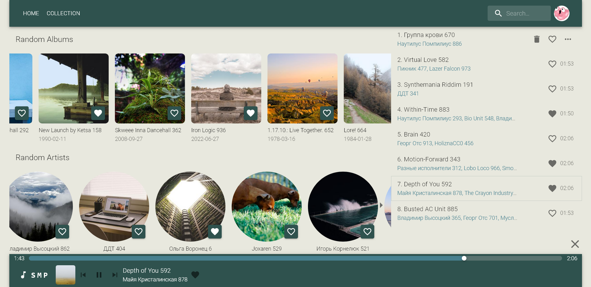
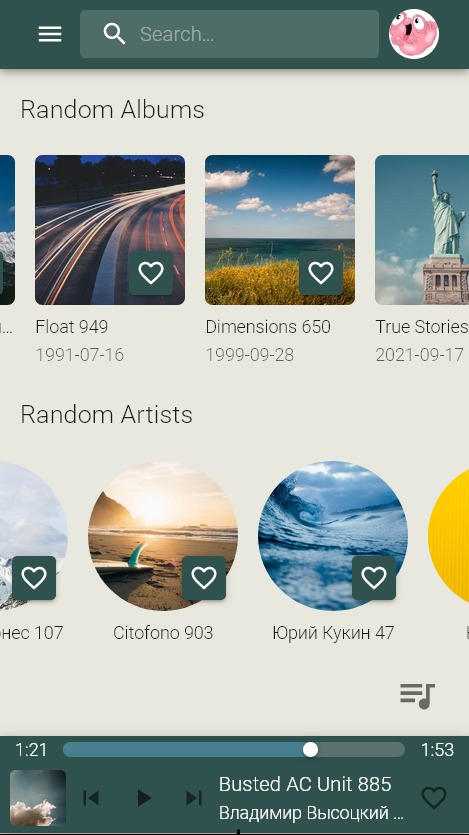
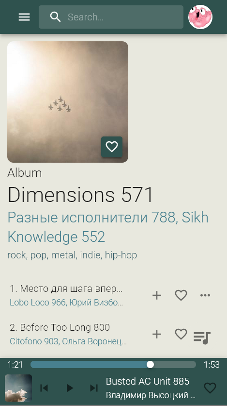
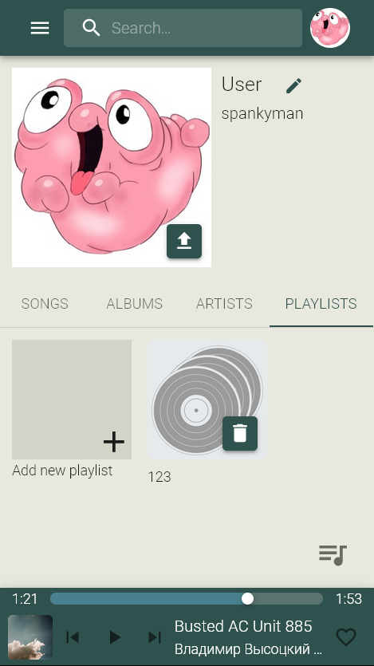

# 🎵 Simple Music Player (SMP) — Frontend
Frontend part of Spotify-like music streaming service builded with Javascript (React + MUI).

  
  
  

## Demo
**App:** http://septerra.duckdns.org:33333

Username: spankyman

Password: 123

## Features
* Songs, albums, artists, playlists
* Music player with queue
* Tracks searching by name and artist
* Material design responsive UI builded with React and MUI